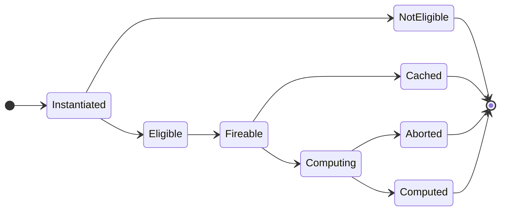

# Cypherflow

Cypherflow is an execution engine that incorporates dataflow concepts using the Cypher Query Language.

Execution results are cached in a property graph for future querying. Should no results return for a given subgraph, an appropriately formed one will serve as a declarative expression for reification through tasking in a dataflow-like manner.

## Implementation Details

- Results are cached in Experience and Submission graph databases.
- Services using Cypherflow need to implement: Expression Parsers and Tasks.

### Databases

- The Experience DB contains the consolidated experience of all computed task outputs.
- The Submissions DB can be used to track submissions history and task statuses within a submission.

### Expression Parsers

- An expression parser translates a string-based expression into a Cypher query for engine submission.
- This removes the need for end-users to write Cypher and allows for multiple ways to express a submission.

### Tasks

- A task is a lifecycle-based conditional execution unit that could reify parts of a graph.
- Each task defines a specification for its inputs and output, as well as a compute function.
- Tasks can indirectly react to the completion of other tasks (à la dataflow).

#### Lifecycle



|              | Task Created? | Input Spec Matched? | Input Data Ready? | Output Cached? | Result Computed? |
|:-------------|:-------------:|:-------------------:|:-----------------:|:--------------:|:----------------:|
| Instantiated |       Y       |          -          |         -         |       -        |        -         |
| Not Eligible |       Y       |          N          |         -         |       -        |        -         |
| Eligible     |       Y       |          Y          |         N         |       -        |        -         |
| Fireable     |       Y       |          Y          |         Y         |       -        |        -         |
| Cached       |       Y       |          Y          |         Y         |       Y        |        -         |
| Computing    |       Y       |          Y          |         Y         |       N        |        -         |
| Aborted      |       Y       |          Y          |         Y         |       N        |        N         |
| Computed     |       Y       |          Y          |         Y         |       N        |        Y         |

#### Specification

- Array of inputs each defined by a pattern path pointing to the output node (each element must be named). 
- One output node.

#### Compute Function

- TBD.

## Demos

Demos are included as pedological tools to understand how Cypherflow works.

```sh
# Clone repository.
git clone https://github.com/jthuraisamy/Cypherflow.git
cd ./Cypherflow/demos/<DEMO_NAME>

# Run application via Docker Compose.
sudo docker-compose up --build

# Visit http://localhost:4000 in browser.

# Run the following before CD-ing into another demo folder.
sudo docker-compose down --volumes
```

### Access

- Demo UI: http://localhost:4000
- Event Bus: http://localhost:4001
- Experience Graph: http://localhost:4002
- Submissions Graph: http://localhost:4003
