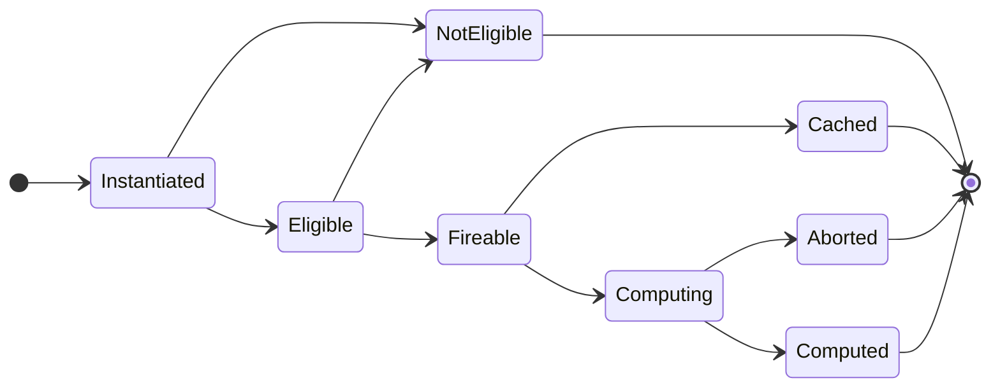

# Tic-Tac-Toe Demo

## Assumptions

To understand the actual intended purpose this demo serves, some suspension of disbelief would be appropriate with the following assumptions:

- Consistent and immutable rules for maximizing reward (winning) do not exist.

## Tasks

| Name            | Fireable When                        | Computed When                        |
|:----------------|:-------------------------------------|--------------------------------------|
| InitializeBoard |  |  |
| PlaceMark       |  |  |

> Note: Each task can output only one node (green) and any edges associated with it.

## Expression Parsers

| Name           | Example                                                  |
|:---------------|:---------------------------------------------------------|
| JsonExpression | `{ "board": [0, 0, 0, 0, 0, 0, 0, 0, 0], "move": "X0" }` |

## Detailed Walkthrough

### Graph Submission

A player is starting a new game and intends to place X in position 0:


The intention is translated to a `submitMove` mutation request via the GraphQL API in `WebService`:

```graphql
mutation {
  submitMove(board: [0, 0, 0, 0, 0, 0, 0, 0, 0], move: "X0")
}
```

The resolver for this mutation publishes the arguments to the `SubmitExpression` channel in Redis PubSub:

```json
{
  "board": [0, 0, 0, 0, 0, 0, 0, 0, 0],
  "move": "X0"
}
```

The channel has a consumer in `GameService` which receives it and passes it to the designated parser, `JsonExpression`. The parser creates the following query for submission to the engine:

```cypher
MERGE (old:Board {value: "[0,0,0,0,0,0,0,0,0]", graphId: "01GDV0PDH3G4V37SP3VS0YX6CX"})
CREATE (new:Board {graphId: "01GDV0PDH3G4V37SP3VS0YX6CX"})
CREATE (old)-[move:NEXT_MOVE {value: "X0", graphId: "01GDV0PDH3G4V37SP3VS0YX6CX"}]->(new)
```

As you can see, each node and edge is tagged with  a `graphId` ([ULID](https://github.com/ulid/spec)) to help distinguish the submissions in the database. Side note: The board is currently serialized as a string because the AST transform function in the [cypher.js](https://github.com/jthuraisamy/cypher.js) library does not support forming arrays (to be resolved later). 

Visually, the submitted graph looks like this:


### Instantiating Tasks

After the write query is executed in the Submissions DB, a message is published in the `CreateGraph` channel to trigger tasking:

```json
{
  "id": "01GDV0PDH3G4V37SP3VS0YX6CX",
  "expression": "{\"board\":[0,0,0,0,0,0,0,0,0],\"move\":\"X0\"}"
}
```

Any service subscribing to that channel can check to see whether its [supported tasks](/demos/TicTacToe/GameService/src/main.ts#L14) can participate in each submitted graph. [For each task](/src/index.ts#L175), the service scans the graph for eligible output nodes that the task can potentially generate. Specifically, it is looking for nodes that [match](/src/tasking/BaseTask.ts#L533) the expected output labels and do not appear to be in a *computed* state (a lifecycle term we will circle back to). The number of found nodes determines how many instances of the task should be spun-up for this graph.

In this case, the `GameService` iterates through two tasks: `InitializeBoard` and `PlaceMark`. For each task, two instances are created because both nodes in the submission match the expected output label (`Board`) and do not appear to be in a computed state (as per the specification diagrams [above](#tasks)).

### Task Lifecycle

With a total of four tasks being created, we can step through their lifecycles and the dataflow-like interactions they have toward the outcome of contributing to the experience graph. Recall that the lifecycle for tasks looks like this:



#### Instantiated ➔ Eligible / NotEligible

| Task Type       | Task ID                      | Output Node ID | Status       |
|:----------------|:-----------------------------|:---------------|:-------------|
| InitializeBoard | `01GDV0PDK6JSPJ02T9CVB7JX2P` | 0              | Instantiated |
| InitializeBoard | `01GDV0PDK9E0MME36AA0CFK18F` | 1              | Instantiated |
| PlaceMark       | `01GDV0PDKJ5BGSQTSTEC8XGYKJ` | 0              | Instantiated |
| PlaceMark       | `01GDV0PDKK8AQX83D5P23HY22Y` | 1              | Instantiated |

At this initial point, all the tasks are in an Instantiated state, and the next step for each task is call the `isEligible()` function. Although each output node appears to be a candidate the task can compute, we also need to know whether the input specifications for the task match with the output node.

Consider the Submissions DB queries below that check the eligibility of the two `PlaceMark` tasks. The first one will fail to match because there are no nodes that connect toward node #0. The second one will successfully match because node #0 is a `Board` node that connects toward node #1 (also `Board`) with a `NEXT_MOVE` relationship. 

```cypher
2022-09-26T01:00:19.719Z - PlaceMark(01GDV0PDKJ5BGSQTSTEC8XGYKJ) | MATCH (old:Board)-[move:NEXT_MOVE]->(new:Board)
2022-09-26T01:00:19.719Z - PlaceMark(01GDV0PDKJ5BGSQTSTEC8XGYKJ) | WHERE ID(new) = 0
2022-09-26T01:00:19.719Z - PlaceMark(01GDV0PDKJ5BGSQTSTEC8XGYKJ) | RETURN old, move, new;

2022-09-26T01:00:19.835Z - PlaceMark(01GDV0PDKK8AQX83D5P23HY22Y) | MATCH (old:Board)-[move:NEXT_MOVE]->(new:Board)
2022-09-26T01:00:19.835Z - PlaceMark(01GDV0PDKK8AQX83D5P23HY22Y) | WHERE ID(new) = 1
2022-09-26T01:00:19.835Z - PlaceMark(01GDV0PDKK8AQX83D5P23HY22Y) | RETURN old, move, new;
```

Another way to think about the eligibility check is to visualize whether the "shape" of the task can be laid over each candidate output node:

| Task ID   | Visual                               | Status      |
|:----------|:-------------------------------------|:------------|
| `...GYKJ` |  | NotEligible |
| `...Y22Y` |  | Eligible    |

#### Eligible ➔ Fireable / NotEligible

| Task Type       | Task ID                          | Output Node ID | Status              |
|:----------------|:---------------------------------|:---------------|:--------------------|
| InitializeBoard | `01GDV0PDK6JSPJ02T9CVB7JX2P`     | 0              | **Eligible**        |
| InitializeBoard | `01GDV0PDK9E0MME36AA0CFK18F`     | 1              | **Eligible**        |
| ~~PlaceMark~~   | ~~`01GDV0PDKJ5BGSQTSTEC8XGYKJ`~~ | ~~0~~          | ~~**NotEligible**~~ |
| PlaceMark       | `01GDV0PDKK8AQX83D5P23HY22Y`     | 1              | **Eligible**        |

After a task is in an Eligible state, the next state it can transition to is being either Fireable or NotEligible. The task's state will transition to Fireable as soon as all the input data it requires is present in the Submission Graph. Alternatively, if the output node is found to have been computed at a later point (due to factors external to this task), the task's state will transition to NotEligible.

Let's analyze the remaining tasks above to see how they transition. For visual analysis, recall both the [submitted graph](#graph-submission) and the [task diagrams](#tasks) at the top that indicate when each task is fireable. 

1. `...JX2P` will transition to Fireable because the `value` property is defined for node #0, and currently no `taskId` property defined. The `taskId` property is automatically added to output nodes after computation so we know which task was responsible for it. After this node is computed, we should expect it to have a `taskId` value of `...JX2P`.
2. `...K18F` will remain in an Eligible state because there is no `value` property defined for node #1. We will revisit this task at a later point as the graph updates.
3. `...Y22Y` will remain in an Eligible state because although the `value` property is defined for the `NEXT_MOVE` relationship, node #0 does not have a `taskId` property defined. We should expect it to have one after `...JX2P` is computed. This makes sense because in our Experience Graph, we want new moves to occur from prior Board positions we have experienced. We cannot make a new move from a Board state we have yet to encounter. From a design standpoint, this is a way to convey control-flow dependencies between tasks without the tasks themselves needing to coordinate with each other. We will also revisit this task at a later point.   

#### Fireable ➔ Cached / Computing

| Task Type       | Task ID                          | Output Node ID | Status          |
|:----------------|:---------------------------------|:---------------|:----------------|
| InitializeBoard | `01GDV0PDK6JSPJ02T9CVB7JX2P`     | 0              | **Fireable**    |
| InitializeBoard | `01GDV0PDK9E0MME36AA0CFK18F`     | 1              | Eligible        |
| ~~PlaceMark~~   | ~~`01GDV0PDKJ5BGSQTSTEC8XGYKJ`~~ | ~~0~~          | ~~NotEligible~~ |
| PlaceMark       | `01GDV0PDKK8AQX83D5P23HY22Y`     | 1              | Eligible        |

After a task has transitioned to a Fireable state, the task will check if the output already exists in the Experience Graph. If so, it will transition to a Cached state, and if not, it will transition to a Computing state. The Experience Graph query will check to see if the specified inputs exist with an output node already connected to them. If a valid output node is found, its properties are then propagated to the Submission Graph. 

Let's see how this Experience Graph query plays out for `InitializeBoard(...JX2P)` (the only Fireable task at this time):

```
2022-10-15T20:26:21.472Z - InitializeBoard(...JX2P) | MATCH (old:Board {value: "[0,0,0,0,0,0,0,0,0]"})
2022-10-15T20:26:21.472Z - InitializeBoard(...JX2P) | MATCH (old:Board) WHERE (old.value IS NOT NULL AND old.taskId IS NOT NULL)
2022-10-15T20:26:21.472Z - InitializeBoard(...JX2P) | RETURN old;
```

The behaviour from this point can vary depending on whether any results are returned:

##### Results Found ➔ Cached

If there are results, then the properties of the output node from the Experience Graph will be propagated to the corresponding output in the Submission Graph, and the task will transition to a Cached state. This transition will trigger any Eligible tasks in the Submission Graph to re-evaluate whether they are still Eligible, and if so, re-evaluate whether they can transition to a Fireable state.

Recall that a PlaceMark task requires the input Board node to have a `taskId` property for it to be Fireable. If an InitializeBoard task transitions to Cached, the `taskId` value of its output node will propagate to the Submission Graph. The presence of the `taskId` value will allow the corresponding PlaceMark task to transition to a Fireable state. This is an example of how a state transition in one task (InitializeBoard) can affect the state of another task (PlaceMark) without the tasks directly coordinating with each other.

##### No Results ➔ Computing

If there are no results, then the task will transition to the Computing state. During this state, the task's `compute()` function will execute. This function will establish what properties should propagate to the output node. After computation, both the Experience and Submission Graph will be updated, and the task will transition to a Computed state. As with the state transition to Cached, this will also trigger any Eligible tasks in the Submission Graph to re-evaluate whether they are still Eligible, and if so, re-evaluate whether they can transition to a Fireable state.

## Recommendations

Over time as more games are played (and more experience is collected), the Experience Graph serves an increasingly useful role in providing _next move_ recommendations to players.


At a high level, the main principle in providing recommendations is to recognize the player's current state and return courses of action that lead toward the desired outcome. As experience is collected through the execution of PlaceMark tasks, Board nodes become connected in a manner that looks like this:


Intuitively, we can visually see what the paths to winning outcomes look like. Programmatically, we can track the player's current state using the `value` property of the Board nodes (e.g. `"[0,0,0,0,0,0,0,0,0]"` for the starting state of a game), and we can track their desired outcome using the `state` property of those nodes (e.g. `"WIN_X"` for Player X). This then translates into the following Cypher query:

```
MATCH (current:Board {value: $current_state})-[moves:NEXT_MOVE *]->(terminal:Board {state: $desired_outcome})
RETURN moves;
```

If we were playing X at the start of a new game, the query would look like this:

```
MATCH (current:Board {value: "[0,0,0,0,0,0,0,0,0]"})-[moves:NEXT_MOVE *]->(terminal:Board {state: "WIN_X"})
RETURN moves;
```

This would return three arrays corresponding to the rows in the game UI that recommend X0, X4, and X6 as the next moves. Each array contains a sequence of edges starting from the current Board and ending at a winning Board.
